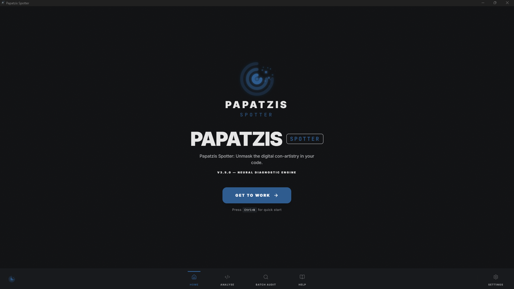
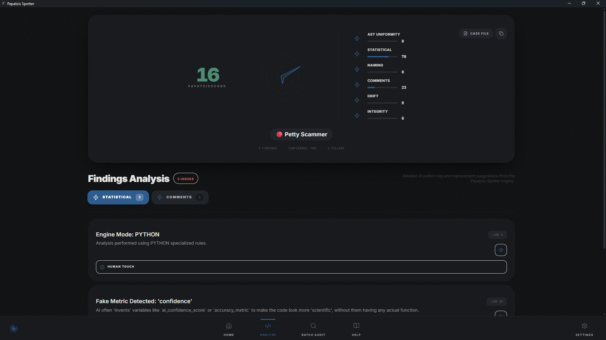
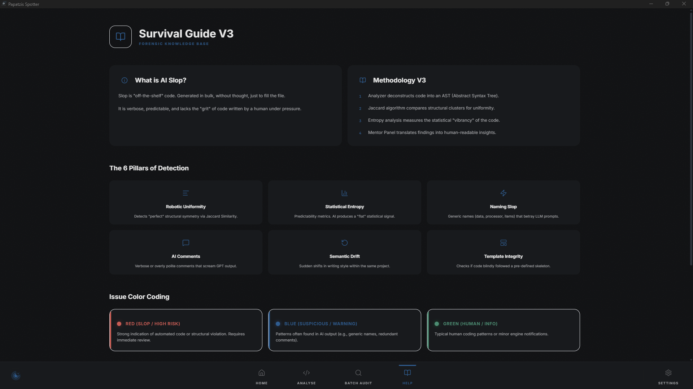

# Papatzis Spotter
## The Offline AI-Slop Detection Engine

[](https://github.com/christoskataxenos/papatzis-spotter/releases)
[](LICENSE)
[](https://python.org)
[](https://github.com/christoskataxenos/papatzis-spotter)

---

### [ Ελληνικά ](#ελληνικά) | [ English ](#english) | [ Download Stable ](https://github.com/christoskataxenos/papatzis-spotter/releases/tag/stable_release) | [ V3 Changelog ](CHANGELOG_V3.md)

---

<a name="ελληνικά"></a>
## Το Motivation πίσω από το Project

### Από το "Vibe" στα Δεδομένα
Η ιδέα για το **Papatzis Spotter** γεννήθηκε από μια πραγματική ανάγκη για τεχνική τεκμηρίωση απέναντι στο "ψηφιακό gaslighting". 

Όλα ξεκίνησαν όταν κλήθηκα να αξιολογήσω κώδικα που παρουσιάστηκε ως "ακαδημαϊκό πρότυπο". Ως developer, παρατήρησα αμέσως την έλλειψη "ανθρώπινου αποτυπώματος":
- **Υπερβολική Φλυαρία:** Σχόλια που εξηγούσαν τα αυτονόητα με αποστειρωμένη ευγένεια.
- **Μηχανική Δομή:** Μια τέλεια αλλά "άψυχη" οργάνωση που θύμιζε default output των LLMs.

Μετά από δοκιμές σε τοπικό tech stack (local LLMs σε Proxmox server), η ετυμηγορία ήταν ομόφωνη: **High-dose AI Slop.** Το Papatzis Spotter μετατρέπει αυτή τη διαίσθηση σε **συγκεκριμένα metrics**.

---

## Technical Architecture V3.5

Ο μηχανισμός ανάλυσης V3.5 "ξεκοιλιάζει" τον κώδικα μέσω AST (Abstract Syntax Tree), αλγορίθμων Jaccard και στατιστικής εντροπίας:

| Pillar | Description | Detection Logic |
| :--- | :--- | :--- |
| **Robotic Uniformity** | Δομική Ομοιομορφία | Χρήση **Jaccard Similarity** για εντοπισμό "factory-made" δομών κώδικα. |
| **Statistical Entropy** | Προβλεψιμότητα | Μέτρηση της στατιστικής εντροπίας (ο άνθρωπος εισάγει "θόρυβο", το AI είναι flat). |
| **Template Integrity** | Πιστότητα Προτύπου | Έλεγχος αν ο χρήστης τήρησε τις προδιαγραφές ή αν "δανείστηκε" έτοιμο AI σκελετό. |
| **Comment Analysis** | Πιστότητα Ύφους | Αξιολόγηση "GPT-style" ευγένειας και εγκυκλοπαιδικής φλυαρίας. |
| **Naming Conventions** | Μηχανική Ονοματολογία | Ανίχνευση ονομάτων που παράγονται από στατιστικά heuristics μηχανών. |

---

<a name="english"></a>
## Developer Motivation (EN)

### From "Vibe" to Data
**Papatzis Spotter** was built to provide technical documentation against "digital gaslighting." 

Reviewing code presented as "academic standard" revealed a clear lack of "human scent":
- **Verbosity Overload:** Sterile comments explaining the obvious.
- **Mechanical Structure:** "Soulless" organization mirroring default LLM outputs.

Verified through local LLM testing (Proxmox stack), the verdict was clear: **High-dose AI Slop.** This tool converts gut feelings into **concrete metrics**.

---

## Visual Interface

<p align="center">
  
  <br>
  <i><b>The Neural Diagnostic Hub</b> — Where the hunt begins.</i>
</p>

<p align="center">
  
  <br>
  <i><b>Forensic Findings</b> — Deep-dive analysis with intelligent grouping and scoring.</i>
</p>

<p align="center">
  
  <br>
  <i><b>The Survival Guide</b> — Understanding the patterns of digital con-artistry.</i>
</p>

---

## Key Features V3.5

- **Entropy-Driven Detection:** High-precision analysis based on information entropy.
- **Batch Audit:** Scan entire directories recursively to detect project-wide AI patterns.
- **Mentor Panel:** Interactive code inspection with intelligent severity grouping.
- **Forensic Color Coding:** Clear visual indicators (Red/Blue/Green) for findings.
- **Bottom Navigation:** Modern, responsive workspace for deep code analysis.
- **100% Offline:** Embedded analysis engine (sidecar) for maximum privacy.
- **Industrial Dashboard:** Professional radar charts and animated forensic summaries.

---

## Installation & Setup

### Automated Start (Windows)
```powershell
./run_orchestrator.bat
```

### Manual Download
Latest stable binaries are available in the [Releases](https://github.com/christoskataxenos/papatzis-spotter/releases/tag/stable_release) section.

---

## Diagnostic Output Examples

### Case A: Human-crafted code
```bash
[OK] Slop Score: 12.4%
[OK] Humanity shield active.
[OK] Craftsmanship detected.
[READY] Safe for production.
```

### Case B: Detected Slop
```bash
[FAIL] Slop Score: 98.3%
[!] Pillar: Robotic Uniformity (93.3)
[!] Finding: Jaccard Cluster Overlap detected (>0.9).
[STATUS] High Risk: AI-Generated Slop.
```

---
*Built for objectivity in code origin analysis. No cloud, 100% offline.*

