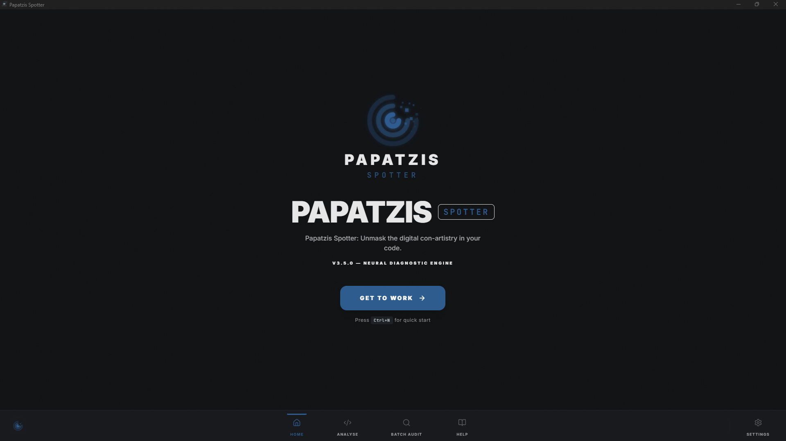
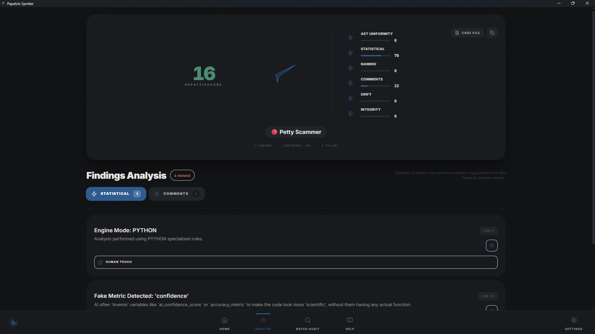
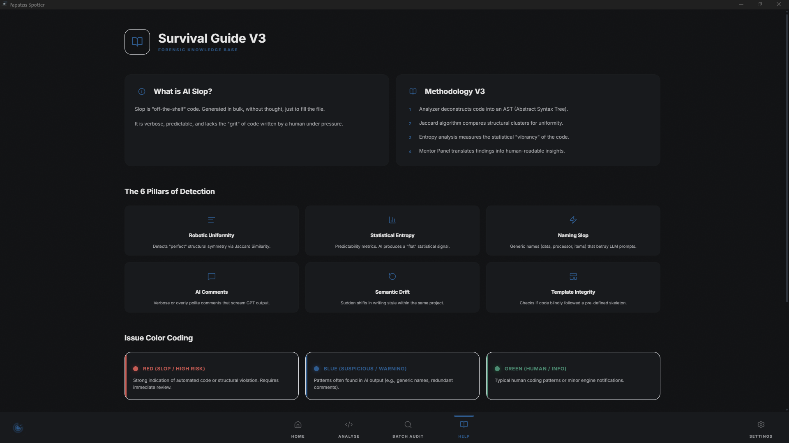

# Papatzis Spotter
## The Offline AI-Slop Detection Engine

[](https://github.com/christoskataxenos/papatzis-spotter/releases/tag/v3.5)
[](LICENSE)
[](https://python.org)
[](https://github.com/christoskataxenos/papatzis-spotter)

---

### [ 🌐 Ελληνική Έκδοση ](README_GR.md) | [ 📥 Download Stable ](https://github.com/christoskataxenos/papatzis-spotter/releases/tag/v3.5) | [ 📜 Full Changelog ](CHANGELOG.md)

---

## 📍 Quick Navigation
*   [The Papatzis Story](#the-papatzis-story)
*   [100% Offline & Private](#100-offline--private)
*   [The 5 Pillars of Detection](#the-5-pillars-of-detection)
*   [How it Works (The Math)](#how-it-works-the-math)
*   [Installation](#installation)
*   [Screenshots](#screenshots)
*   [The Ecosystem](#the-ecosystem)

---

<a name="the-papatzis-story"></a>
## 📖 The Papatzis Story: From "Vibe" to Data

**Papatzis Spotter** was born out of a moment of pure realization. It started when I was asked to review code presented as "academic standard." Looking at the source code, something started "screaming." The code had no "human scent."

It displayed all those repetitive, overly polite, and sterile patterns that betray AI:
- **Verbosity Overload:** Comments explaining the obvious with sterile politeness.
- **Mechanical Structure:** A perfect but "soulless" organization mirroring default LLM outputs.

Papatzis Spotter converts this intuition into **concrete metrics**. It’s not a tool for "war" against AI, but a mirror that shows you the "slop" generated by LLMs, forcing you to take responsibility for your code.

[⬆ Back to top](#papatzis-spotter)

---

<a name="100-offline--private"></a>
## 🔒 100% Offline & Private

Unlike other tools, **Papatzis Spotter** respects your code:
*   **Zero Internet Usage:** The tool works fully offline.
*   **No AI API Calls:** We don't send your data to OpenAI, Gemini, or Claude.
*   **Local Analysis:** All mathematical calculations and AST parsing are done exclusively on your CPU.
*   **Multithreaded Performance:** The analysis engine scales with your system's cores, delivering results faster than most cloud-based solutions.
*   **No Data Leaks:** Your code never leaves your system.

[⬆ Back to top](#papatzis-spotter)

---

<a name="the-5-pillars-of-detection"></a>
## 🛡️ The 5 Pillars of Detection (The Logic)

The Analyzer doesn't guess. It "dissects" the code through 5 relentless filters:

### 1. Robotic Uniformity (Architecture Overkill)
AI has an obsession: it wants to look "enterprise-ready." This leads to a tragic Logic-to-Boilerplate ratio.

**❌ AI Slop (15 lines for nothing):**
```python
class IStringProcessor(ABC):
    @abstractmethod
    def process(self, s: str) -> str: pass

class IdentityProcessor(IStringProcessor):
    def process(self, s: str) -> str: return s.strip()

def factory(): return IdentityProcessor()

# 30 lines later...
proc = factory()
result = proc.process(" hello ")
```

**✅ Human Logic (1 line that does the job):**
```python
def clean_text(s: str): return s.strip()

result = clean_text(" hello ")
```

- **Diagnosis:** Severe Structural Slop. The code was written to impress, not to solve a problem.

### 2. Statistical Verbosity (Hadouken Code)
Detecting overly rigid tree structures (nesting) and variables that sound smart but are empty of meaning.

### 3. Naming Slop (Enterprise Naming)
No human under pressure would name a function `execute_symmetrical_textual_entity_validation_sequence()`. It’s the "formal wear" AI puts on to hide its lack of creativity.

### 4. GPT-Style Linguistic DNA
Detecting buzzwords that are "hallmarks" of LLMs in comments (*delving into*, *holistic paradigm*, *robustness*).

### 5. Project Drift (Entropy)
Humans are chaotic. AI is terrifyingly consistent. If 100 files have the exact same "sterile" structure, it's a product of a generator, not a project.

[⬆ Back to top](#papatzis-spotter)

---

<a name="how-it-works-the-math"></a>
## 🧮 How it Works (The Math)

### Jaccard Similarity: The "Bag of Marbles" Theory
Imagine two bags of colored marbles. Jaccard measures how many marbles are **exactly the same** compared to the **total**.
- In Papatzis Spotter, the "marbles" are code patterns.
- The closer the score is to 1, the more the code is a "duplicate" of robotic patterns.

### Shannon Entropy (Statistical Entropy)
We measure the "noise" in the code. Human code has natural inconsistencies. AI code is often "statistically sterile" (low entropy).

### Semantic Echo Mapping
We analyze the "geometry" of the logic (AST). Even if you change variable names, the AI's skeleton remains the same.

[⬆ Back to top](#papatzis-spotter)

---

<a name="installation"></a>
## 🚀 Installation

### Windows (Automated)
Simply run the orchestrator script:
```powershell
./scripts/run_orchestrator.bat
```

### Linux / macOS
Requires Python 3.10+. Simply run:
```bash
./scripts/run_orchestrator.sh
```
*(Debian .deb and RPM packages coming soon)*

[📥 Download Latest Stable](https://github.com/christoskataxenos/papatzis-spotter/releases/tag/v3.5)

[⬆ Back to top](#papatzis-spotter)

---

<a name="screenshots"></a>
## 📸 Screenshots

<p align="center">
  
  <br>
  <i><b>The Neural Diagnostic Hub</b> — Where the hunt begins.</i>
</p>

<p align="center">
  
  <br>
  <i><b>Forensic Findings</b> — Deep-dive analysis with intelligent grouping and scoring.</i>
</p>

<p align="center">
  
  <br>
  <i><b>The Survival Guide</b> — Understanding the patterns of digital con-artistry.</i>
</p>

[⬆ Back to top](#papatzis-spotter)

---

<a name="the-ecosystem"></a>
## 🌐 The Ecosystem

- **Papatzis UI:** Premium application built with Tauri & Rust featuring radar charts.
- **Git Bouncer:** A "bouncer" (pre-commit hook) that blocks slop before it hits GitHub.
- **Papatzoskill:** The "vaccine" for AI agents (Claude, Gemini) that forces them to write quality code.

[⬆ Back to top](#papatzis-spotter)

---

<a name="philosophy-and-ethics"></a>
## ⚖️ Philosophy: Audit, Learn, Master

**Papatzis Spotter** is a tool with a dual nature:

1.  **For the Auditor (Professor/Lead Dev):** An objective forensic assistant to expose "digital gaslighting" and identify AI-generated boilerplate.
2.  **For the Creator (Student/Developer):** A **Mentor**. Through Mentor Hints, it helps you understand where AI "failed" you, suggesting more human-centric, efficient ways to write code.

**The Lesson:** The problem isn't using AI—it's losing control. Papatzis Spotter helps you put the human back in the driver's seat.

---
*Built for objectivity in code origin analysis. No cloud, 100% offline.*
